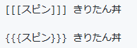

# 装飾系

## カスタム絵文字
基本的にインスタンス管理者が登録する絵文字  
Misskey, Mastodon 全般で使える, AP連携あり

`:カスタム絵文字名:`

## 外部カスタム絵文字
外部インスタンスのカスタム絵文字を参照できる  
独自, 同じ対応をしているインスタンスとは連携できる

`:カスタム絵文字名@インスタンス:` 

## アバター絵文字
ユーザーアイコンを絵文字に出来る  
独自, 同じ対応をしているインスタンスとは連携できる

`:@user:`

`:@user@インスタンス:`

※ 絵文字の類は表示された投稿を選択してコピペできる

## Misskey標準文字装飾
MFMと呼ばれるMisskeyの文字装飾  
Misskey間では基本的に連携できる, 同じ対応をしているインスタンスとは連携できる

[https://joinmisskey.github.io/ja/wiki/usage/mfm/](https://joinmisskey.github.io/ja/wiki/usage/mfm/)


`**太字**`

`<center>中央揃え</center>`

`~~打ち消し線~~`

`<i>斜体</i>`

`<small>小さい字</small>`

`<motion>モーション</motion>`  
~~15文字 or 5エレメント / 1つ かつ 5つまで~~ => 100文字 or 20エレメント / 1つ かつ 50まで

`(((モーション)))`

`*** ビッグ＋ ***`  
~~15文字 or 5エレメント / 1つ かつ 3つまで~~ => 100文字 or 20エレメント / 1つ かつ 50まで

`<flip>左右反転</flip>`

```
<spin>回転</spin>
<spin right>右回転</spin>
<spin left>左回転</spin>
<spin alternate>往復回転</spin>
```
~~10文字 or 5エレメント / 1つ かつ 5つまで~~ => 100文字 or 20エレメント / 1つ かつ 50まで

`<jump>ジャンプ</jump>`  
~~30文字 or 5エレメント / 1つ かつ 5つまで~~ => 100文字 or 20エレメント / 1つ かつ 50まで

````
```
コードブロック
```
````

````
`インラインコード`
````

````
"
引用ブロック
"
````

`> 引用行`

`検索 検索`

`[リンク](url)`

`?[詳細なしリンク](url)`

`【タイトル】`

`[タイトル]`

`\(インライン数式\)`

```
\[
ブロック数式
]\
```

## 追加文字装飾
独自
```
<vflip>上下反転</vflip>

<rotate DEG>指定角度回転</rotate>
```

## 互換文字装飾

